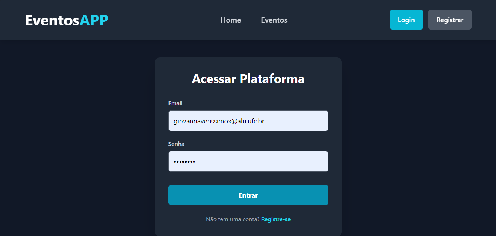
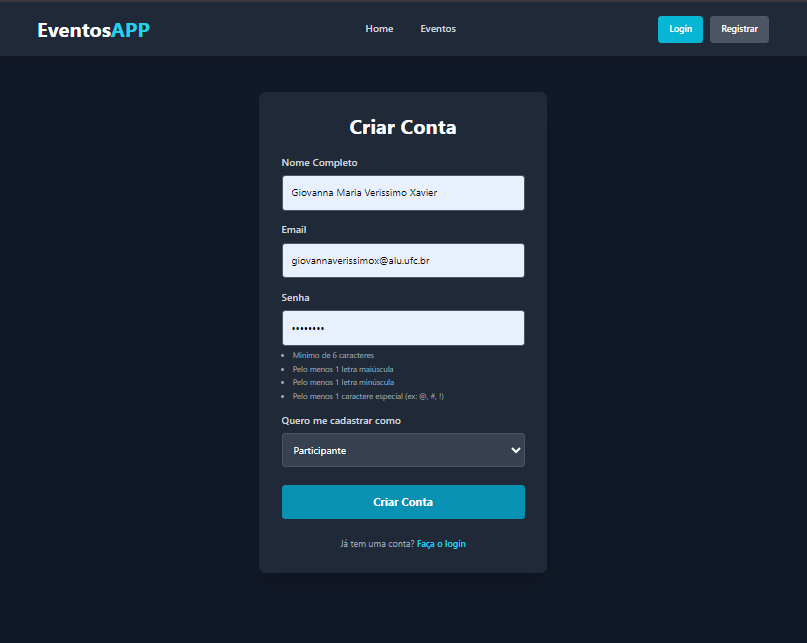
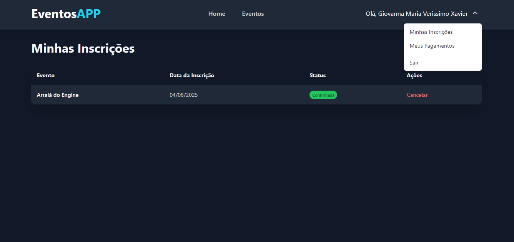
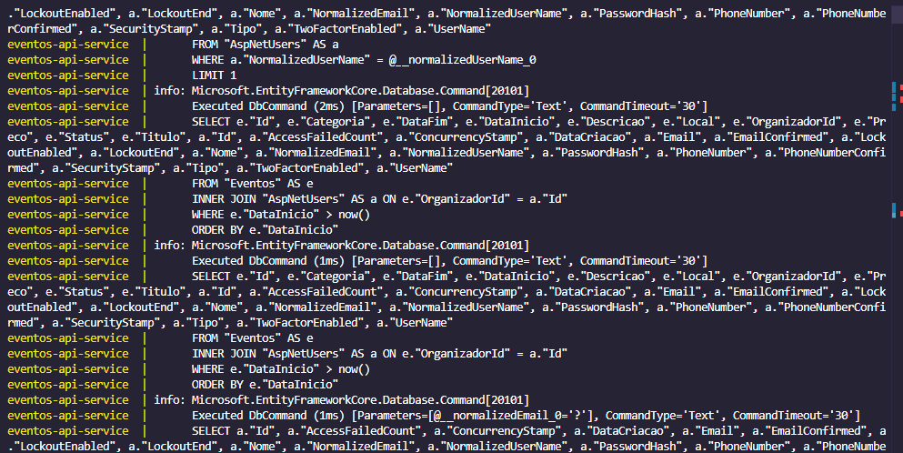
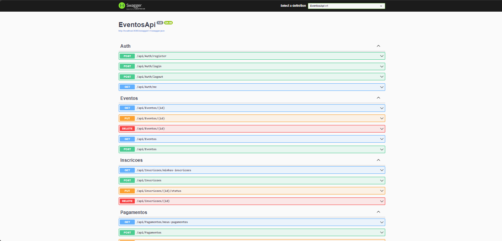
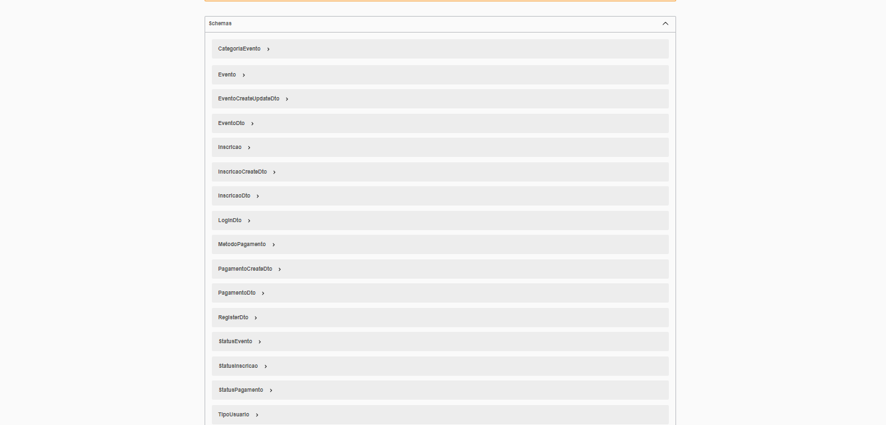

# 📅 Sistema de Eventos - Criação e Inscrição

Este projeto é uma aplicação web para **criação e inscrição em eventos**, desenvolvida com foco em simplicidade e praticidade.

---

## 🚀 Funcionalidades

- ✅ Cadastro de usuários  
- ✅ Login e autenticação  
- ✅ Criação de eventos  
- ✅ Listagem de eventos disponíveis  
- ✅ Inscrição em eventos  
- ✅ Visualização de eventos inscritos  
- ✅ Pagamento de eventos
- ✅ Tela de Eventos Inscritos do Usuário Logado
- ✅ Tela de Detalhes do Evento do Organizador (Editar e Excluir)

---

## 🖼️ Prints da Aplicação

### 🔐 Tela de Login


### 📝 Tela de Cadastro


### 🎉 Tela de Criação de Evento


### 📃 Tela de Lista de Eventos


### 📥 Tela de Inscrição em Evento


### 💳 Tela de Pagamento


### 📋 Tela de Eventos Inscritos do Usuário Logado


### 🛠️ Tela de Detalhes do Evento do Organizador (Editar e Excluir)


> **Observação:** Usuário normal: Giovanna | Usuário organizador: Humberto

### 🐳 Docker rodando


### 📚 Swagger da API
  


---

## 🧑‍💻 Como Rodar o Projeto

### 🔹 1. Clone o repositório
```bash
git clone https://github.com/seu-usuario/seu-repo.git
